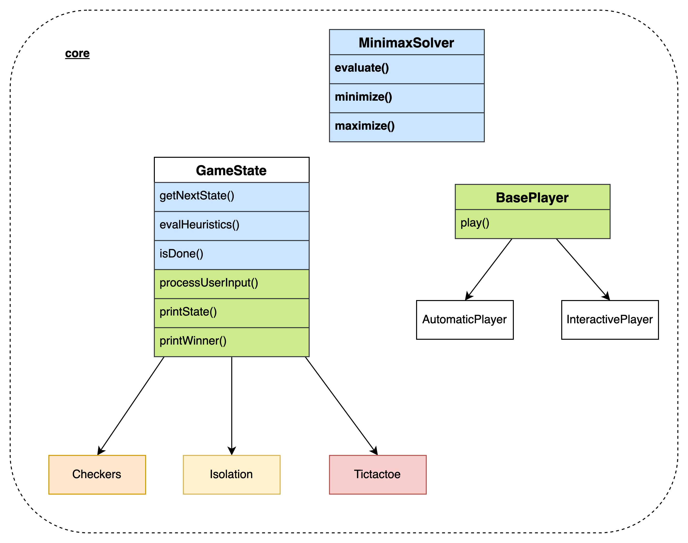
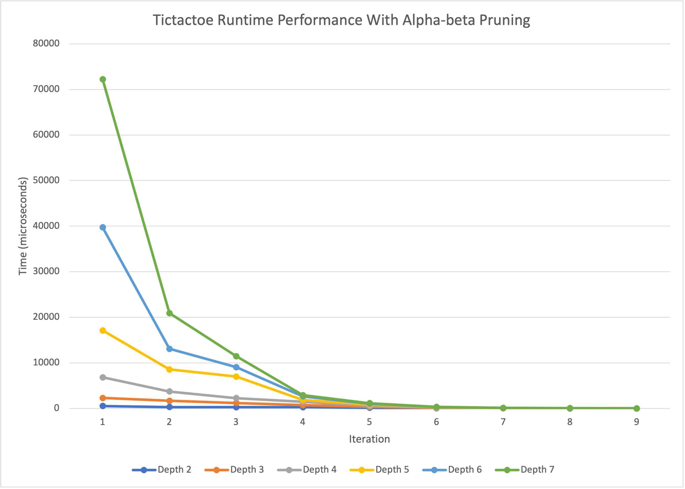
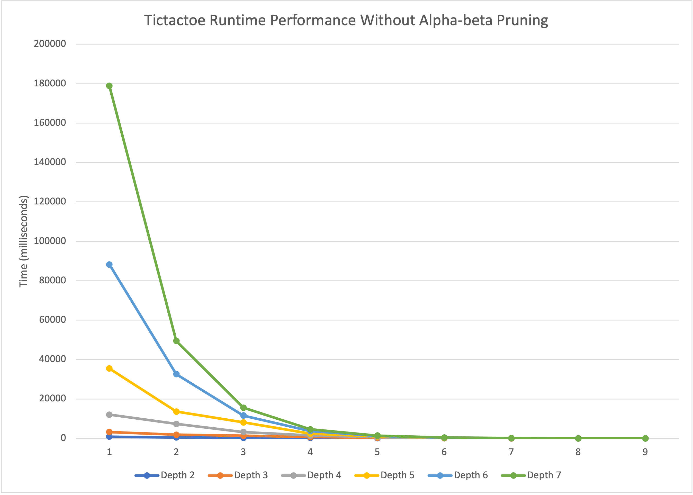
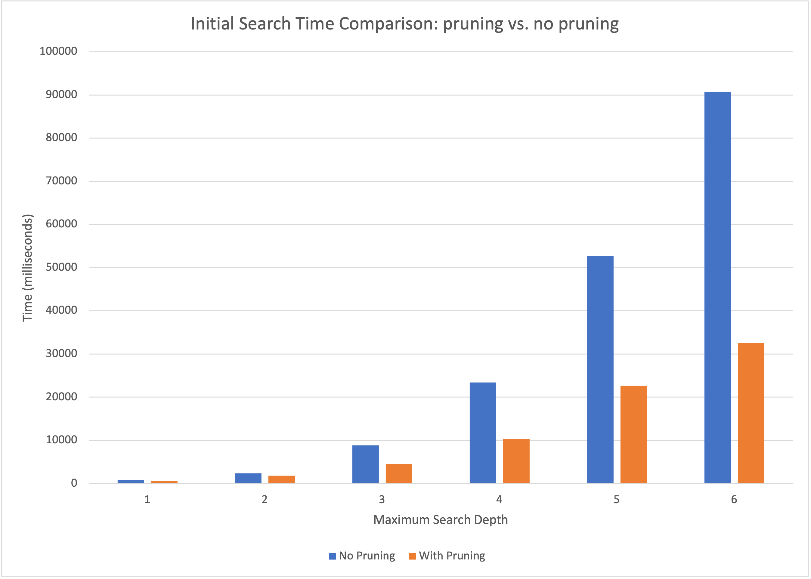

# Design Choices
The core of our Minimax library lays in the core folder. Here is an overview of the major components.

At its top, we have the generic minimax solver. It has an `evaluate` that kicks off the minimax algorithm. When the algorithm queries for states specific to the game, uses four generic functions built in the `GameState` generic class: `getNextState()`, `evalHeuristics()`, and `isDone()`. 

Individual games, such as checkers, isolation, and tictactoe must implement the three functions above in order to utilize the minimax solver. Of course, these classes can contain many other functions to manipulate its own state.

We also implemented a generic player library that facilitates the playing of the games. There are two main types of players: automatic player and interactive player. The automatic player, implemented via the `AutomaticPlayer` class, simulates the playing of two opponents via optimal strategies, while the interactive player, implemented via the `InteractivePlayer` class, allows users to directly play games on the terminal. Both types of players inherit from the base class `BasePlayer` and must implement the `play` function. 

Both `AutomaticPlayer` and `InteractivePlayer` invoke the four functions `printState()`, `makeMove()`, `getWinner()`, and `setPlayer` from the base GameState class. Similar to the minimax framework above, it is also the individual game's responsibility to implement these four generic functions.

In summary, our library is very adaptable for supporting new games. In order to utilize the minimax solver, one will need to implement three functions specific to state management: `getNextState()`, `evalHeuristics()`, and `isDone()`. In order to support automatic and interactive player, one will need to implement another set of functions: `printState()`, `makeMove()`, `getWinner()`, and `setPlayer`.

# Performance
We measured the performance of the tictactoe game at various search depths and found that as expected, greater search depths lead to longer runtime. As the board becomes less empty, the max search depth decreases, leading to faster runtime.

The runtime is also impacted by alpha-beta pruning. We can drastically decrease runtime after utilizing alpha-beta pruning.

|Tictactoe Runtime Performance With Alpha-beta Pruning | Tictactoe Runtime Performance Without Alpha-beta Pruning|
|--|--|
|||

A comparison between pruning vs. no pruning is made for an initially empty tic-tac-toe board. We can see that especially when the max search depth is very large, alpha-beta pruning reduces the search time by more than 1/2.

# Looking ahead: C++ 20
Currently, clang does not fully support C++ 20. However, in the future, if this changes, we hope to incorporate the following into our library:
* Modules: export the minimax solver as modules
* Parallelism: support parallel evaluation of the minimax algorithm for better performance
